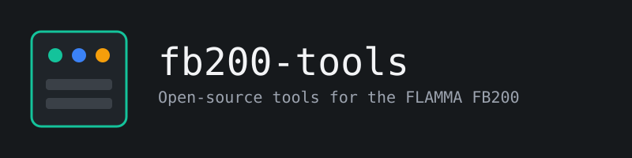
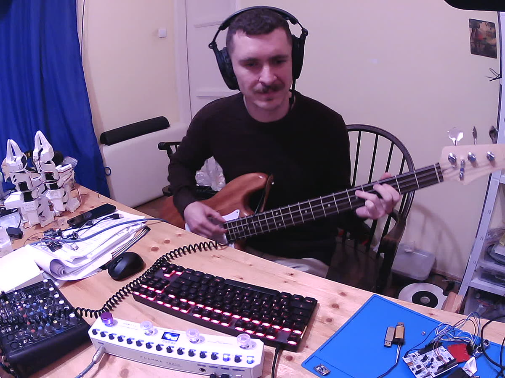

# fb200-tools: open firmware for the FLAMMA FB200

**Open-source replacement firmware and tools for the
[FLAMMA FB200](https://www.flamma.shop/products/flamma-fb200-bass-guitar-intelligent-combined-multi-effects-pedal)
bass multi-effects pedal.** It sounds like the stock firmware, keeps your presets and the
official app working, and adds what the stock firmware lacks: USB updates without a
button combo, a debug console, crash reports, better display feedback, drums in
your recordings and a bass delay. Add what you want: the software is yours to modify.



[](https://buymeacoffee.com/3qutj2ucoq)

## Why

The FB200 is a good little bass pedal built around a 600 MHz Cortex-M7 (i.MX RT1052).
Its firmware is closed and frozen. This project aims to:

- **match the stock firmware.** Every stock effect was ported and checked against an
  emulation of the stock DSP code.
- **then improve on it.** Done: a bass delay. The plan: 48 kHz / 24-bit audio, longer
  cab IRs with WAV import, a clean-blend drive for bass, a web editor, and NAM amp captures.
  See [`docs/PARITY.md`](docs/PARITY.md) and
  [`docs/ROADMAP_RESEARCH.md`](docs/ROADMAP_RESEARCH.md).

## Status (v0.8)

Verified on a real pedal:

| Area | What works |
| --- | --- |
| **Sound** | Stock chain: noise gate → compressor → 10 amp models + 4-band tone stack → 10 cab IRs + 9 user-IR slots → 12 modulations → 5 reverbs. Parity against the stock DSP: amp and tone bit-exact, the rest within -105 dB. The heaviest preset uses 27% of the CPU on average, 31% at peak. |
| **Front panel** | 3-digit display, 16 knobs with LEDs, 4 footswitches with the stock actions (slot select, bank chords, stomp mode, tuner, save). |
| **Presets** | Your stock presets load and save in the stock format and survive switching firmware |
| **Drums & tuner** | Stock drum machine (40 rhythms, played from the samples already in your pedal's flash) and stock YIN tuner |
| **USB** | Class-compliant audio interface (record and play back, 44.1 kHz). The stock USB identity and control protocol, so `fb200 info` and IR import work. |
| **Bluetooth** | Module link. The Bluetooth audio input runs; playback from a phone is not yet checked by ear. The app protocol is implemented and tested on the host, but not yet with the Flamma Manager phone app. |
| **Power** | Battery level, charger sense, status LED |
| **Updates & recovery** | USB updates with no button combo. A resident recovery keeps the USB console after a crash or hang. Crash dumps survive a reset. |

New in 0.7 and 0.8, tested on the host but **not yet checked on a pedal**: the bass
delay, save to any slot and to another bank, the stock rhythm-mode buttons,
drum/tuner/rhythm-mode commands from the app, input gain, tuner calibration and mute,
factory reset, and the footswitch light rings (live-mode modules, colours from the app,
save blink, rhythm tempo flash). On the pedal so far: the light ring of the selected slot.

**Better than stock so far:**
- A bass delay (the stock has none: its delay settings do nothing): 20-1000 ms, feedback,
  mix, low cut on the repeats, tone. Stock presets keep their sound
  ([`docs/PARITY.md`](docs/PARITY.md#m4-bass-delay)).
- A bass EQ (the stock has none): HPF, 5 bands, LPF, after the cab; set from the console
  or MCP and stored in the preset (stock presets keep it off)
  ([`docs/PARITY.md`](docs/PARITY.md#m4-bass-eq)).
- Updates over USB without holding A+D.
- The display names the knob you turn (`GAn`, `CAb`, …) and marks knobs that have not
  picked up yet.
- Hold **A** and turn LEVEL / RATE / MOD to change drum level, tempo or rhythm live.
- Drums are included in the USB recording.
- Choosing an empty IR slot never silences the pedal.
- Drum hits start on time (the stock plays each one up to 31 ms early).
- The Bluetooth audio switch from the app survives a reboot (the stock turns it back on).

Still open: the pedal checks above, a test session with the phone app, a 48 kHz option, and
the "better" roadmap. The code runs on the stock hardware only.

## Flashing

> Flashing custom firmware is **at your own risk**; read [`DISCLAIMER.md`](DISCLAIMER.md).
> The vendor bootloader and your presets are never overwritten, and holding **A+D at
> power-on** always gets you back to the vendor updater.

**Easiest: flash from the browser.** Open
**[shylenko.com/fb200-tools/flash.html](https://shylenko.com/fb200-tools/flash.html)**
in Chrome or Edge (Windows, macOS, Linux, ChromeOS). Nothing to install. It takes the
latest release and guides you step by step.

The first install needs your copy of the **official FB200 firmware file (`.mr`)**. It
supplies the vendor loader and the stock sound data, so this repository and its
releases contain no vendor code or data. Updates after that need no `.mr` and no
button combo.

From the command line (macOS, Linux):

```bash
python3 -m pip install "fb200-tools[hid] @ git+https://github.com/w1ne/fb200-tools"

# first install, once
fb200 fw twostage ~/Downloads/FB200_V1.0.1.mr -o fb200-twostage.mr
#   hold A+D while plugging in USB, then:
fb200 fw flash fb200-twostage.mr --yes --no-jump
fb200 update app latest
fb200 update stock ~/Downloads/FB200_V1.0.1.mr

# every later update
fb200 update app latest
```

The factory reset needs the factory presets in the stock sound data (sound data version 2).
If you wrote the sound data with fb200-tools 0.6.0 or earlier, run
`fb200 update stock ~/Downloads/FB200_V1.0.1.mr` once more (your sound works without it).

**Back to stock** at any time: hold A+D while plugging in, then run
`fb200 fw flash FB200_V1.0.1.mr --yes --no-jump`. Full guide, building from source and
Linux permissions: **[`docs/INSTALL.md`](docs/INSTALL.md)**.

## Using the pedal

The controls work as on the stock firmware:

| Action | What it does |
| --- | --- |
| **A / B / C / D** | select slot A–D of the shown bank (display `P<bank><slot>`) |
| **C + D** / **A + B** | bank up / bank down. Your edits stay: the display flashes the new bank; press A–D to load a preset from it, or hold one to save there. After about 2 s the display goes back to the current bank. |
| **B + C** | live mode (`L…`): A = reverb, B = mod, C = amp+cab, D = comp on/off. C turns amp and cab off if either is on. |
| **hold A, B, C or D (1 s)** | save the current sound to that slot of the shown bank (preset and live mode) |
| **hold B, then A long** | tuner (display: flat arrow, note, sharp arrow; knob LEDs off); any switch exits |
| **hold C, then B long** | rhythm mode (`d<rhythm>`): A / B previous / next rhythm, C tap tempo (two taps or more), D play/stop |
| **hold A + turn LEVEL / RATE / MOD** | drum level / tempo / rhythm, live. Start turning within 1 s: holding A alone saves. |

**Knobs**, left to right: MASTER, LEVEL (reverb), REVERB, MIX, RATE, MOD, CAB, VOL,
BASS, MID, TREBLE, GAIN, AMP, LEVEL (comp), THRESH, GATE.

After a preset loads, a knob takes over once it passes the preset's value. Until then
its LED **blinks** and the display shows the value with a dot. The LED is off when that
effect is off in the preset.

**USB audio:** choose "FB200 Audio I/O" in your DAW. It records the processed sound
plus drums, and plays computer audio through the pedal. For reamping, `fb200 console
"usb in"` sends the computer audio through the effects instead of the instrument: play
a DI track, record the processed result (`usb mix` adds it to the instrument, `usb out`
is the default).

## Host tools

The `fb200` command also works with the stock firmware:

```bash
fb200 info                          # product, firmware, Bluetooth and hardware versions
fb200 ir list                       # IR slots
fb200 ir import 3 my-cab.wav        # convert and upload a WAV IR to slot 3
fb200 ir process my-cab.wav -o out.wav --trim --taps 512   # process to a file, no pedal
fb200 console [cmd ...]             # open-firmware USB console (interactive without args)
fb200 console "factory yes"         # factory reset: presets, settings, IR list
fb200 console "delay on 350"        # bass delay: [on|off] [time] [fb] [mix] [lowcut] [tone]
fb200 console "eq 1 40 3"           # bass EQ: eq [on|off] | hpf <hz> | lpf <hz> | <band 1-5> <hz> <dB> [q]
fb200 console prof                  # CPU cycles per chain stage
fb200 console "usb in"              # reamping: computer playback into the effects (out: default)
fb200 update app latest             # open-firmware USB update (or a file)
fb200 update stock FB200.mr         # write the stock sound data (once)
fb200 crash --elf fb200-app.elf     # read and symbolize the last crash dump
fb200 fw inspect|flash ...          # .mr container tools and the vendor updater client
```

### IR import

`fb200 ir import` and `fb200 ir process` convert any WAV (8/16/24/32-bit PCM or
32-bit float, any rate) to 44.1 kHz with a Kaiser windowed-sinc resampler. With no
options the result is the same as the official editor: channel 0, 1024 samples, cut or
zero-padded. The pedal plays the first 512 taps and sets the loudness itself. Options,
applied in this order:

| Option | Effect |
| --- | --- |
| `--channel left\|right\|sum` | channel 0 (default), channel 1, or the mean of all channels |
| `--blend other.wav:0.3` | mix 30 % of a second IR in, aligned by onset and cross-correlation |
| `--lowcut HZ`, `--highcut HZ` | 2nd-order Butterworth high / low pass, baked into the IR |
| `--trim` | cut the silence before the onset (-60 dB rel. peak), keep 8 samples |
| `--minphase` | cepstral minimum phase; needs numpy: `pip install 'fb200-tools[ir]'` |
| `--taps N` | length 1..4096 (the pedal slot holds 1024, and plays 512); a cut tail gets a half-Hann fade over the last N/8 taps |
| `--normalize` | peak to 1.0 |

`ir process -o out.wav` writes the result as mono 32-bit float at 44.1 kHz, for any IR
loader. From Python: `fb200.wav.process_ir(path_or_bytes, taps=512, trim=True, ...)`
returns the float taps.

Install for development: `.venv/bin/pip install -e ".[dev,hid]"`, then run the host
tests with `.venv/bin/pytest` (under a minute). The slow stock-DSP parity tests
(`-m stock`: unicorn emulation of the stock firmware, need `.[stock]` and your
`fb200-stock.mr` in `FB200_STOCK_MR`) run nightly: `tools/nightly_stock.sh`.

## MCP server

`fb200 mcp` lets an AI agent (Claude Code, Claude Desktop) drive the pedal with the open
firmware over USB. It is an [MCP](https://modelcontextprotocol.io) server on stdio.

```bash
pip install 'fb200-tools[mcp]'          # add numpy sounddevice for audio_test
claude mcp add fb200 -- fb200 mcp
```

| Tool | What it does |
| --- | --- |
| `pedal_status`, `pedal_info` | firmware, engine stats, current preset, USB audio state; versions |
| `console` | run one console command (the tool description lists the command set) |
| `preset`, `save_preset` | show or select preset 0..39; store the edit buffer |
| `get_effects` | all effect blocks of the edit buffer |
| `set_amp`, `set_cab`, `set_comp`, `set_gate`, `set_mod`, `set_reverb` | change fields of one block (app protocol, HID); returns the block read back |
| `set_delay`, `set_eq` | bass delay; bass EQ (on/off, HPF, LPF, band 1-5 freq/gain/q), returns the EQ state; both go into the edit buffer (`save_preset` stores them) |
| `set_output`, `drums`, `tuner` | output gain and mute, drum machine, tuner |
| `usb_route` | USB playback to the output (`out`), into the chain input (`in`, reamping) or summed (`mix`) |
| `cpu_profile`, `crash_dump`, `cab_long` | CPU cycles per chain stage (`prof`); the last crash dump; a synthetic N-tap cab IR for measurements (0 = the preset's cab) |
| `ir_list`, `ir_import` | user IR slots; import a WAV into a slot |
| `audio_test` | play a test signal, capture the USB audio, return RMS, peak, THD (sine) or an octave-band response; can save a WAV |

`audio_test` uses the firmware test generator (`tin`, into the chain input) by default,
so the capture holds all effects. With `source="usb"` the host plays the signal (a
sweep, noise or a DI track as a WAV) through the effects: the tool sets `usb in` for the
test and restores the routing after, and returns the round-trip `delay_ms`.

The tools do not flash firmware (use `fb200 update`). One lock serializes all access to
the pedal. Edits change the live preset until `save_preset`.

## Documentation

| Document | Contents |
| --- | --- |
| [`docs/INSTALL.md`](docs/INSTALL.md) | building, flashing, updating, recovery, back to stock |
| [`docs/PARITY.md`](docs/PARITY.md) | stock feature inventory, status, roadmap, parity tests |
| [`docs/ROADMAP_RESEARCH.md`](docs/ROADMAP_RESEARCH.md) | what "better than stock" means: research with sources |
| [`docs/BOOTLOADER.md`](docs/BOOTLOADER.md) | boot chain, two-stage boot, flash layout, dead ends |
| [`docs/AUDIO_PATH.md`](docs/AUDIO_PATH.md) | codec, SAI, clocks, input path |
| [`docs/UI_AND_STORAGE.md`](docs/UI_AND_STORAGE.md) | display, knobs, LEDs, Bluetooth, preset and settings storage |
| [`docs/PROTOCOL.md`](docs/PROTOCOL.md) | USB/BLE app protocol, full command set |
| [`docs/FIRMWARE_FORMAT.md`](docs/FIRMWARE_FORMAT.md), [`docs/FIRMWARE_BRINGUP.md`](docs/FIRMWARE_BRINGUP.md) | the `.mr` container and vendor boot contract |
| [`docs/HARDWARE.md`](docs/HARDWARE.md), [`docs/pcb/`](docs/pcb/) | hardware notes and PCB photos |
| [`docs/LABWIRED.md`](docs/LABWIRED.md) | LabWired twin of the board: chip/board YAML, smoke and stock-boot gates |

## Credits

- [wattsline/Flamma-FF20](https://github.com/wattsline/Flamma-FF20): protocol research for
  the sibling Flamma FF20.
- [ThijsWithaar/MooerManager](https://github.com/ThijsWithaar/MooerManager),
  [shpala/MooerLooperManager](https://github.com/shpala/MooerLooperManager),
  [utajum/mooer-drummer-x2](https://github.com/utajum/mooer-drummer-x2): Mooer protocol work.
- Built on [TinyUSB](https://github.com/hathach/tinyusb), the
  [MCUXpresso SDK](https://github.com/nxp-mcuxpresso/mcuxsdk-core) and
  [CMSIS-DSP](https://github.com/ARM-software/CMSIS-DSP), fetched at pinned, checksummed
  versions.

## Support

The project is free and stays free. If it is useful to you, you can
[buy me a coffee](https://buymeacoffee.com/3qutj2ucoq).

## License

MIT (see [`LICENSE`](LICENSE)). Images are original works, licensed with the project.

This is an independent, community reverse-engineering effort. It is not affiliated with,
endorsed by, or supported by FLAMMA Innovation or MOOER Audio. All product names and
trademarks belong to their owners and are used only to describe interoperability. The
repository contains no vendor firmware images, code, or asset data (samples, models,
IRs). A few codec register values and filter constants recorded during the reverse
engineering are included for interoperability.
